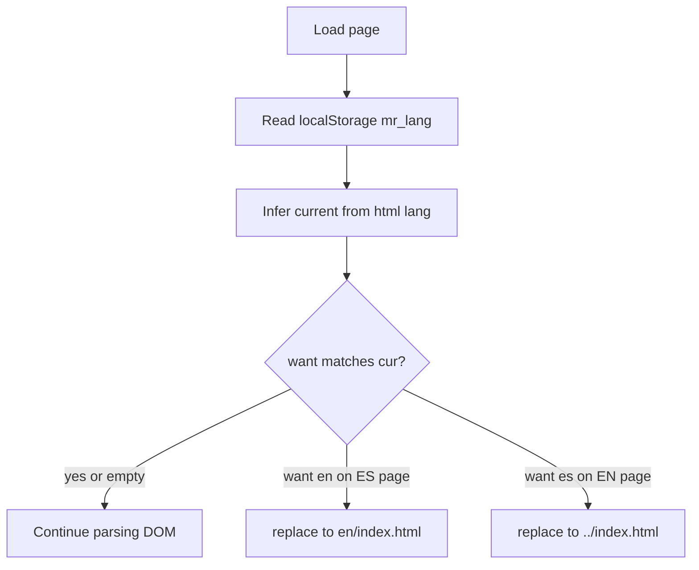

# Preferencia de idioma con localStorage

## Objetivo

Recordar la última elección del usuario entre español e inglés. Al abrir el sitio en una URL que **no** coincide con esa preferencia, redirigir a la URL correcta **antes** de mostrar contenido en el idioma “equivocado”, en la medida de lo posible con HTML estático.

**Almacenamiento elegido:** `localStorage` (persiste entre sesiones y pestañas del mismo origen).

## Comportamiento

1. **Clave y valores** (nombres en inglés, valores ISO cortos):
  - Clave: `mr_lang` (o similar corta y con prefijo del sitio).
  - Valores: `es` | `en`.
2. **Al cargar la página** (script síncrono muy pronto en `<head>`, después de `<meta charset>` y del `<title>` si hace falta, pero **antes** de `</head>`):
  - Leer `localStorage.getItem('mr_lang')`.
  - Inferir idioma **actual** de la página con `document.documentElement.getAttribute('lang')` (`es` si empieza por `es`, si no `en`) — ya está definido en `[index.html](c:\desarrolloWeb\proyectos\martin-ramallo\index.html)` y `[en/index.html](c:\desarrolloWeb\proyectos\martin-ramallo\en\index.html)`.
  - Si `want === 'en'` y página es ES → `location.replace('en/index.html')` desde raíz.
  - Si `want === 'es'` y página es EN → `location.replace('../index.html')` desde `en/`.
  - Si no hay clave o coincide con la página → no hacer nada.
  - Envolver en `try/catch` por si `localStorage` está bloqueado (modo privado estricto, políticas): en ese caso no redirigir ni romper.
3. **Al elegir idioma** (clic en el enlace del conmutador):
  - Antes de seguir el `href`, `localStorage.setItem('mr_lang', 'es'|'en')` (misma clave, dentro de `try/catch`).
  - Opciones de implementación:
    - **Inline** `onclick` en los dos `<a>` del switcher (mínimo acoplamiento, no espera a `scripts.js` con `defer`).
    - O un pequeño bloque inline al final de `<body>` que registre `click` en `.lang-switch a` — menos repetición en HTML pero corre un poco más tarde (el primer paint ya ocurrió; la redirección inicial sigue siendo la del `<head>`).

Recomendación del plan: **onclick inline** en los enlaces ES/EN (solo hay dos archivos, cuatro líneas en total) para garantizar que la preferencia quede guardada incluso si el usuario navega muy rápido.

## Archivos a tocar

| Archivo                                                                    | Cambio                                                                                                     |
| -------------------------------------------------------------------------- | ---------------------------------------------------------------------------------------------------------- |
| `[index.html](c:\desarrolloWeb\proyectos\martin-ramallo\index.html)`       | Script en `<head>` + `onclick` en el `<a href="en/index.html">`                                            |
| `[en/index.html](c:\desarrolloWeb\proyectos\martin-ramallo\en\index.html)` | Script en `<head>` + `onclick` en el `<a href="../index.html">`                                            |
| `[js/scripts.js](c:\desarrolloWeb\proyectos\martin-ramallo\js\scripts.js)` | **Opcional:** no es obligatorio si la persistencia queda en HTML; solo tocar si se centraliza en un helper |

No hace falta cambiar `hreflang` ni metadatos por idioma.

## SEO

- Cada URL sigue sirviendo el mismo HTML fijo (ES en `/`, EN en `/en/`).
- Los rastreadores suelen no tener una `localStorage` previa del usuario; en la práctica indexan la versión por defecto de cada URL.
- La redirección por preferencia es un patrón habitual y no sustituye el contenido “de engaño” por bot; no invalida `hreflang`.

## Parpadeo / UX

- El script en `<head>` minimiza el riesgo de ver un idioma y saltar al otro; puede quedar un flash mínimo en conexiones lentas. Aceptable para un portfolio estático.

## Hosting en subpath (opcional, futuro)

Si el sitio no está en la raíz del origen (p. ej. `https://user.github.io/repo/`), las rutas `en/index.html` y `../index.html` siguen siendo correctas **respecto al documento actual**; no hace falta base URL absoluta para esta lógica.

## Diagrama de flujo

## Fuera de alcance (por ahora)

- Detección automática por `Accept-Language` del navegador sin preferencia guardada.
- Sincronizar con cookie de servidor (sitio 100% estático).

